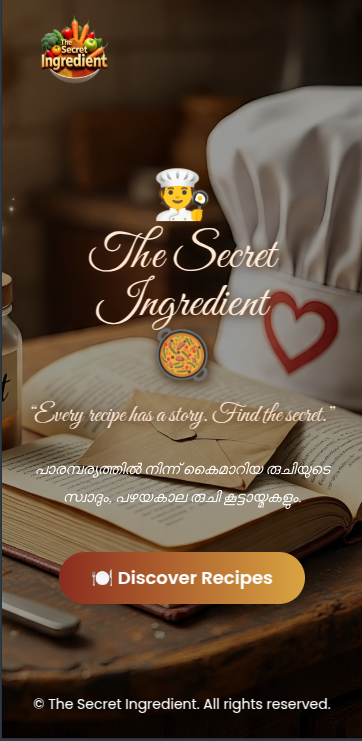
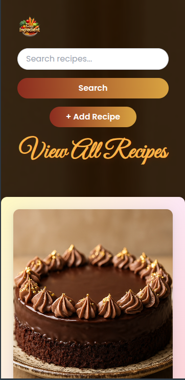
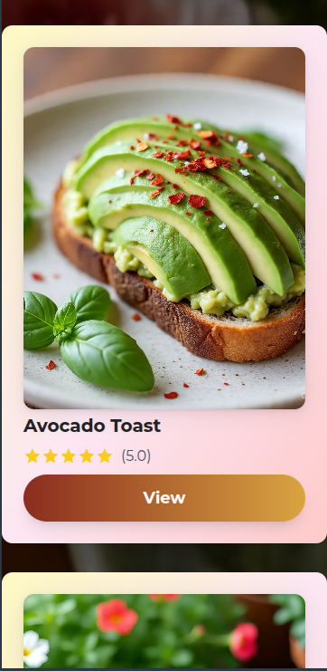
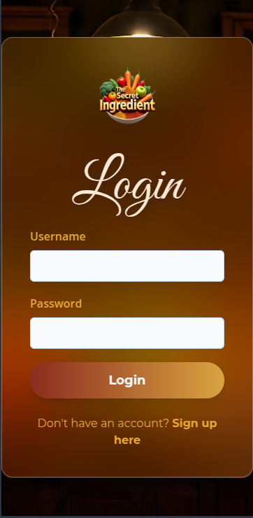
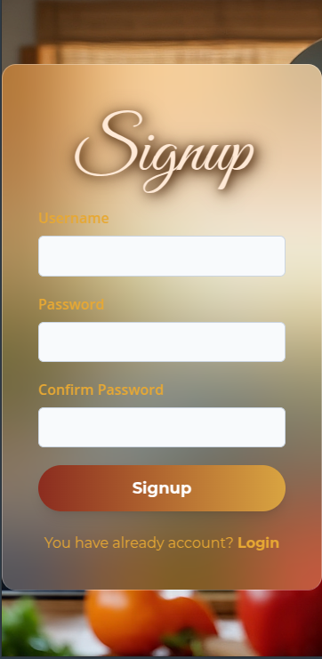

# 🥗 The Secret Ingredient

## 🍽️ Current Updates

- 🚀 **Initial project setup completed**
- 📁 **Directory structure organized**
<!-- - 📝 **README created with latest updates** -->
<!-- - 🌱 **Ingredient database schema designed** -->
<!-- - 🔍 **Basic search functionality implemented** -->
<!-- - 🧪 **Unit tests added for core modules** -->
- 🗂️ **Documentation for setup and usage improved**
- 📱 **Responsive UI implemented for seamless experience across devices**
- 🖋️ **Custom fonts and improved styles for enhanced UI**

## 📸 Current Working Screenshots

Here are some screenshots showcasing the current state of the project:

*Index page displaying the main interface.*

*Ingredient search in action.*

*Login page for existing users to access their accounts.*

*Signup page for new users to create an account.*

